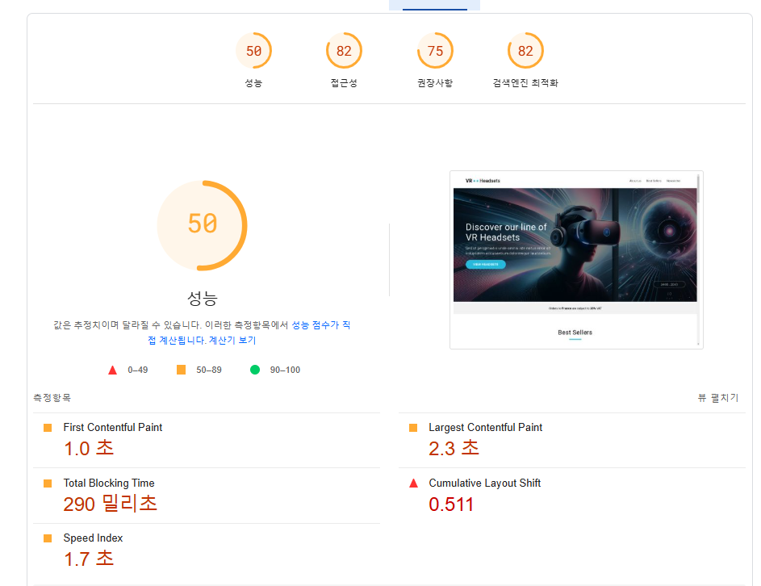
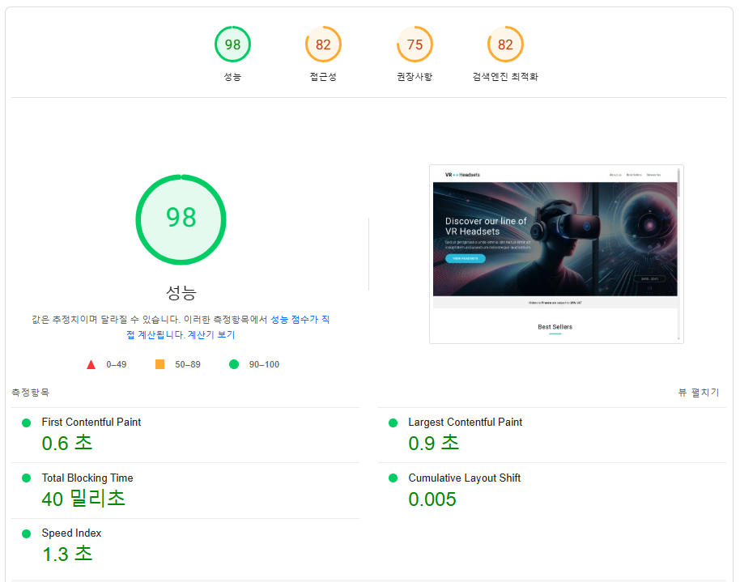
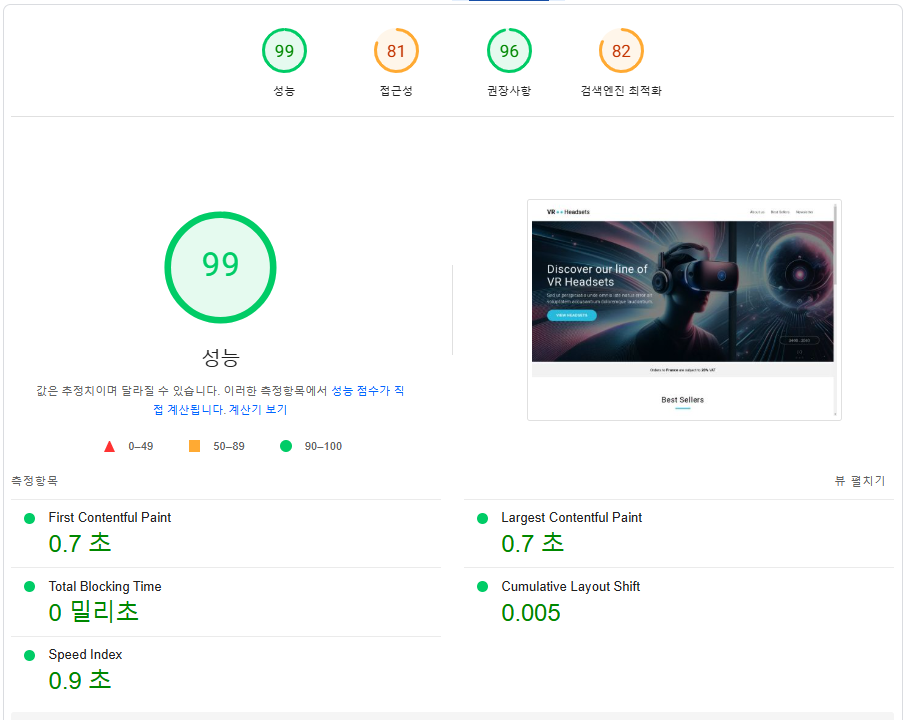
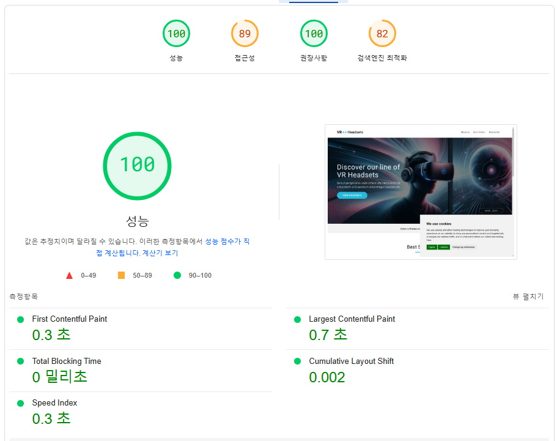

# 웹 성능 최적화 보고서
## 배포 링크
> http://aws-jw.s3-website-us-east-1.amazonaws.com/
## 성능 측정 방법
> PageSpeed Insights

## 개선 이유
- 초기 페이지 로딩 속도 저하
- 높은 리소스 사용량
- Core Web Vitals 지표 미달
- 사용자 경험 개선 필요

## 개선 방법
### (1) 이미지 최적화

- 이미지 리사이징 및 webp 포맷 변환
- 해상도 별 반응형 이미지 설정
- 이미지 width, height 명시
- Lazy Loading 적용
- Layout Shift 최적화
### (2) JavaScript 최적화

- 스크롤 위치에 따른 컨텐츠 로딩으로 초기 로딩 속도 향상
- 상태 관리 추가
- 스크립트 로딩 최적화

### (3) 웹 폰트 최적화

- 로컬 폰트 사용

## 개선 후 향상된 지표

1) Core Web Vitals 개선

|측정 지표|최적화 전|최적화 후|개선율|
|------|---|---|---|
|First Contentful Pain|1.0초|0.3초|70% ↓|
|Largest Contentful Paint|2.3초|0.7초|69.6% ↓|
|Total Blocking Time|290ms|0ms|100% ↓|
|Cumulative Layout Shift|0.511|0.002|99.6% ↓|
|Speed Index1|1.7초|0.3초|82.4% ↓|

- LCP (Largest Contentful Paint)
    - 가장 큰 콘텐츠가 화면에 표시되는 시간
    - 페이지 로드 성능 측정
- INP (Interaction to Next Paint)
    - 사용자 상호작용에 대한 응답 시간
    - 페이지 상호작용 성능 측정
- CLS (Cumulative Layout Shift)
    - 페이지 로딩 중 레이아웃 변경 정도
    - 시각적 안정성 측정

2) 리소스 사용량 개선

3) 사용자 경험 개선

## 참고자료
- Core Web Vitals
- PageSpeed Insights